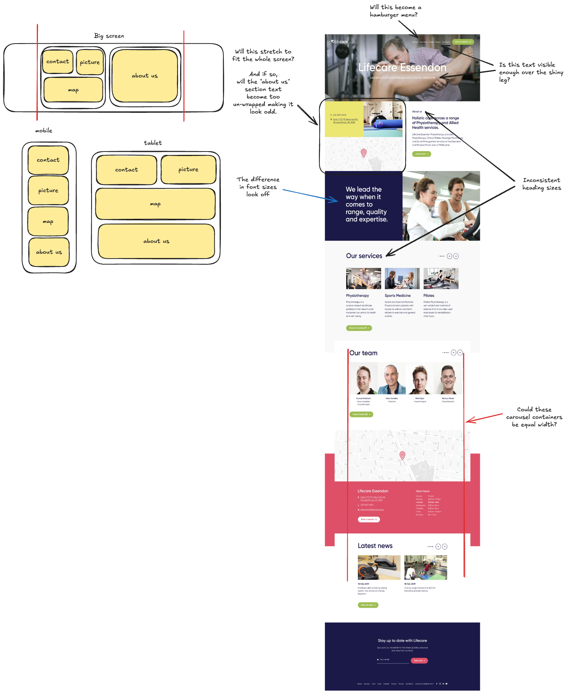

## Section specific feedback

### First section

- Are the navigation bar and the description of the company clear enough text over the background, especially with the description over the shiny leg?
- Do we need to optimise the image for different view ports? (Smaller image for mobile)

### Second section - About us

- Some complexity in responsive layout, the "About us" section
  - Will the boxes stretch the full width of the screen? And if so, will the about us text become too long and thin?
  - How will this become responsive between mobile, tablet and desktop? The left section may need more breakpoint changes than the right side
    (See annotations for more details)

## General inconsistencies

- Inconsistent headings text
  - "about us"
  - "we lead the way..." seems much bigger than the rest of the text
- Different container alignments between carousels and other content

## Development considerations

- Which heading tags are where?
- Do we have different sized images optimised for smaller view ports?

## Feedback for quicker development

- Mobile design and Figma mock ups would be helpful for dev process
  - Will there be a Hamburger menu?
  - How do sections stack on mobile/tablet?
- Creation of components that can be re-used:

  - Button with two variants (The green and red)
  - The map
  - The carousel
  - The container

## Bringing it to life

- Hover effects on the cards (yellow card and images) to make it feel interactive and stand out
- Scroll based animations for the text and headings when the user scrolls down the page
- Possible parallax effect for the background image

## Annotated image

